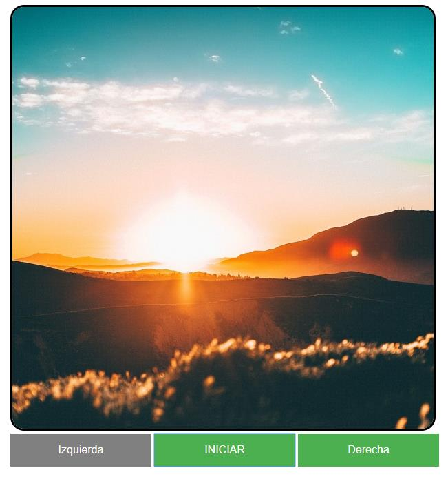

#Trabajo Javascript HTML

####Evidencias 1ra Parte:

**Prueba ingresando letras a la cedula.**

**Prueba de ingreso de una cedula incorrecta.**

**Prueba ingresando letras al campo nombre.**

**Prueba ingresando numeros al campo apellido.**

**Prueba ingresando mas de 10 numeros al telefono.**

**Prueba ingresando un formato invalido en la fecha.**

**Prueba ingresando un correo invalido.**

**Prueba ingresando un passowrd con una complejidad baja.**

**Archivo PHP al cumplir todos los requisitos.**

**Validacion de la estructura HTML en w3 Validator.**

####Evidencias de la galeria de imagenes:

**Al momento de iniciar no funciona el boton izquierdo o de retorno.**

**Al momento de llegar al final de las 5 imagenes se bloquea el boton de siguiente.**

**Validacion de la estructura HTML en w3 Validator.**

